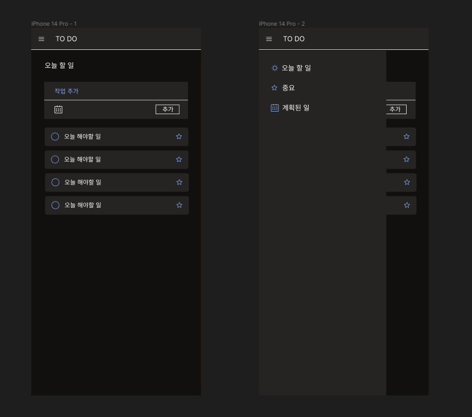

## TO DO LIST

솔로 프로젝트 todo list를 위한 레포지토리입니다.
디자인은 마이크로소프트의 To Do 앱을 참고해서 만들었습니다.

## 초기 디자인

## 사용 스택

- react
- styled components
- redux

## 구현 기능

- 유저 로그인 기능 : 서버 / 데이터 베이스 연동 (node.js / supabase)
- todo CRUD : 데이터 베이스 연동 (supbase)

## 수정하고 싶은 부분

## 완성일
